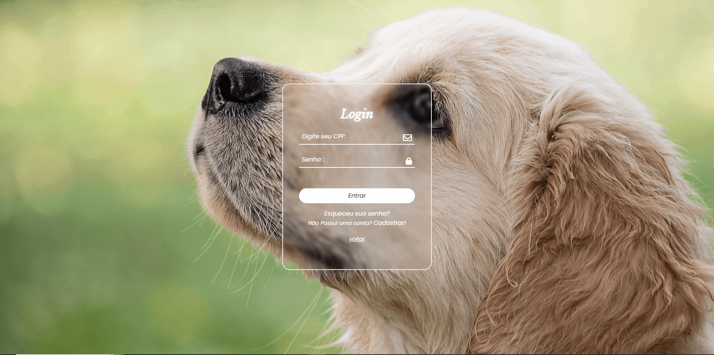
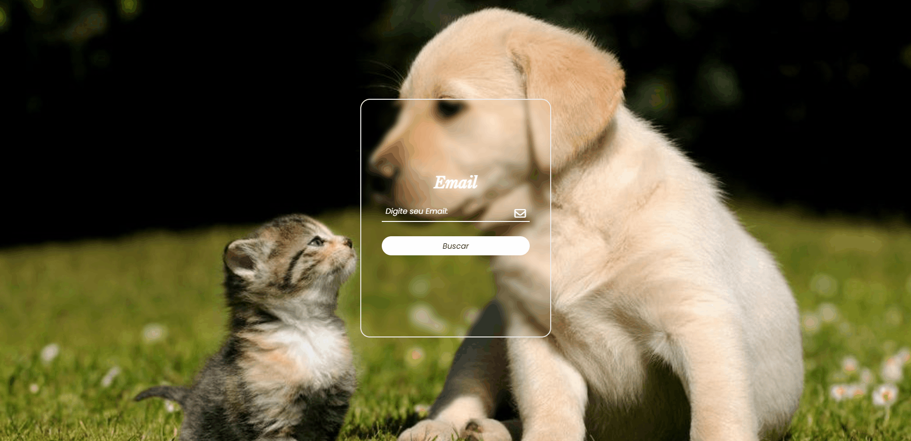
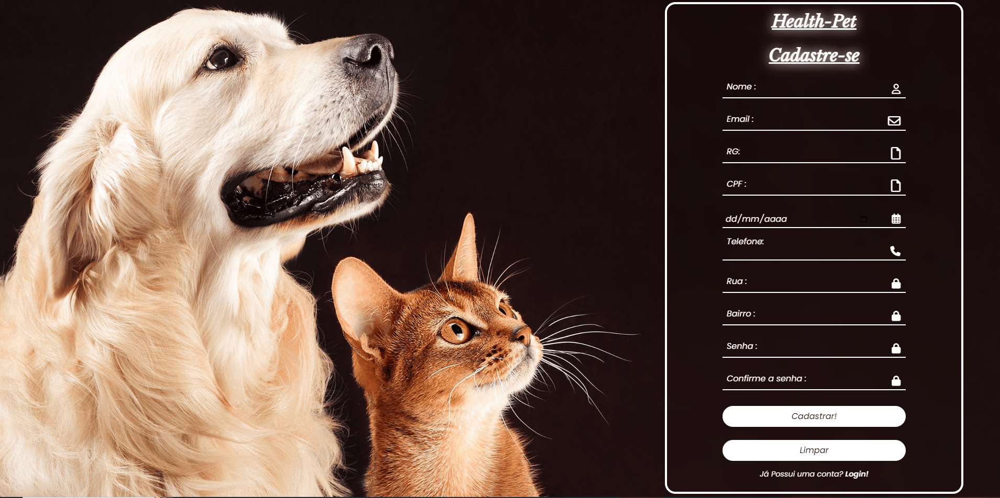
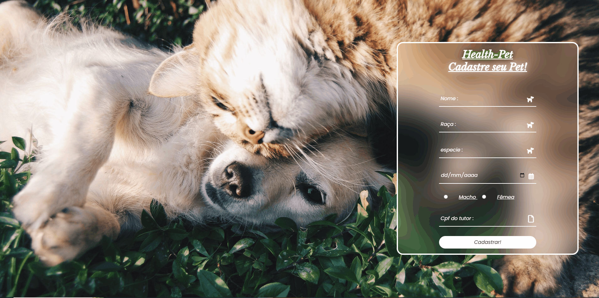

    

>Clínica Veterinária "Health Pet" - Site Institucional
Bem-vindo ao repositório do site institucional da Clínica Veterinária "Health Pet"! Nosso site tem como objetivo fornecer informações sobre os serviços oferecidos, equipe, horário de funcionamento e como entrar em contato conosco.

<h1>Sobre a Clínica</h1>
A Clínica Veterinária "Health Pet" é dedicada ao cuidado e bem-estar de animais de estimação. Nossa missão é oferecer serviços veterinários de alta qualidade e atendimento compassivo para todos os animais que atendemos.
<h3>Recursos:</h3>
Nosso site possui os seguintes recursos:

<h2>Página Inicial:</h2> Apresenta uma breve visão geral da clínica e destaca os principais serviços oferecidos.

<h2>Serviços: </h2> Descreve os serviços veterinários oferecidos, incluindo consultas, vacinação, cirurgias, exames laboratoriais, tratamento de emergência, entre outros.

<h2>Quem somos: </h2>

<h2>Fale conosco:</h2> Oferece diferentes formas de entrar em contato conosco, como telefone, e-mail e formulário de contato online.

 

 
<h1 style="font-family:cursive;">Aqui o Usuário tem como opção Login/Cadastro. </h1>
<h3>Login: </h3>

<h3>Esqueceu sua senha:</h3>

<h3>Cadastrar:</h3>

<h1>Sistema Usuário Web:</h1>

<h3>Tela agendar:</h3>

<h3>Resultados:</h3>

<h3>Meus agendamentos:</h3>

<h3>Consulta pet:</h3>

<h3>Editar Perfil:</h3>

<h3>Dúvidas:</h3>

<h3>Cadastrar Pet:</h3>

<h2>Tecnologias Utilizadas</h2>
O site da Clínica Veterinária "Health Pet" foi desenvolvido utilizando as seguintes tecnologias:

+HTML5

+CSS3

+Bootstrap

+JavaScript

+PHP

<h3>Como Contribuir</h3>

Se você quiser contribuir para o nosso site, sinta-se à vontade para fazer um fork deste repositório, fazer as alterações desejadas e enviar um pull request. Estamos abertos a sugestões de melhorias, correções de bugs e adição de novos recursos.

<h3>Como Executar Localmente</h3>
Se você quiser executar o site localmente em seu computador, siga estas etapas:

Autor
<h4>Este site foi desenvolvido por:</h4>
<ul><a>
<li>[Cesar Augusto Silva Cunha] </li>  Perfil GitHub [Clique Aqui](https://github.com/Cesaracunha)
<li>[Elmar Gouvea Rodrigues Merelis] </li> Perfil GitHub [Clique Aqui](https://github.com/elmarodrigues)
<li>[Gustavo Luiz dos Santos] </li>Perfil GitHub [Clique Aqui](https://github.com/gudevs23)
<li>[João Victor Albuquerque Maia] </li> Perfil GitHub [Clique Aqui](https://github.com/joaovamaia)
<li>[Juan Felipe Aoki Guna] </li> Perfil GitHub [Clique Aqui](https://github.com/jufelipeaoki)
<li>[Pedro Henrique de Oliveira Perse] </li> Perfil GitHub [Clique Aqui](https://github.com/PedroPerse)
</ul>

